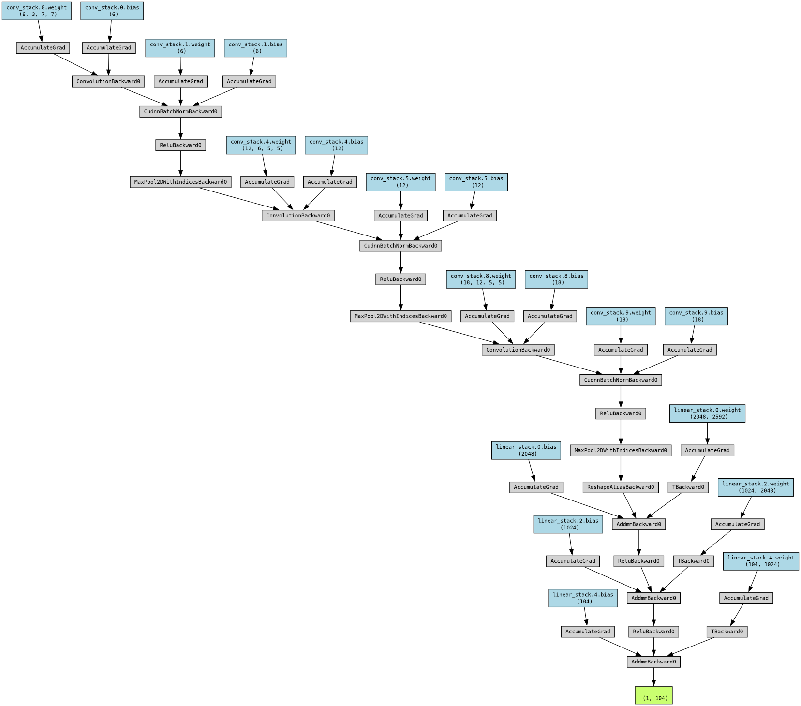

# Petals-to-the-Metal-Kaggle-Competition

## Petals to the Metal - Flower Classification on TPU
### **Overview**

In the "Petals to the Metal" Kaggle competition, the challenge was to build a machine learning model capable of classifying 104 types of flowers from images. This project showcases the journey of leveraging TensorFlow and PyTorch on TPUs to tackle this classification task, emphasizing model building, optimization, and experimentation with data augmentation and regularization techniques.
Dataset

The dataset comprises 104 types of flowers, varying from narrow classes like pink primroses to broad ones like wild roses. It includes training, validation, and test sets provided in TFRecord format, a common choice for TensorFlow applications due to its efficiency in training performance.

* Training Set: Contains labeled samples.
* Validation Set: A pre-split segment of the training data intended for performance evaluation.
* Test Set: Unlabeled samples for which the flower class needs to be predicted.

### **Approach**

The project started with a custom convolutional neural network architecture designed to learn from the diverse and imperfect images in the dataset. Key steps in the development process included:

* Data Augmentation: Implemented to enhance model robustness by introducing variability in the training images, simulating a broader range of real-world conditions.
* Extended Training: Increased the number of training epochs to allow the model more opportunity to learn from the augmented data.
* Learning Rate Adjustment: Utilized a learning rate scheduler to optimize the learning rate during training, improving model convergence.
* L2 Regularization: Added weight decay in the optimizer for L2 regularization, helping to prevent overfitting by penalizing large weights.
* Performance Evaluation: Employed training and validation loss monitoring, along with accuracy metrics, to guide the iterative refinement of the model and training process.

### **Neural Network Architecture**

The custom convolutional neural network (CNN) architecture developed for the "Petals to the Metal" competition is designed to efficiently process and classify images of flowers into 104 categories. The architecture leverages a series of convolutional layers, batch normalization, ReLU activations, and max-pooling to extract and learn hierarchical feature representations from the flower images. The model architecture is as follows:

* **Input Layer:** Accepts color images with a shape of [3, 128, 128], corresponding to 3 color channels (RGB) and an image size of 128x128 pixels.

* **Convolutional Layers:**
  > The first convolutional layer with 6 output channels, a kernel size of 7, and ReLU activation, followed by max-pooling.
  
  > A second convolutional layer increasing the depth to 12 output channels with a kernel size of 5, followed by ReLU activation and max-pooling.
  
  > The third convolutional layer expands the depth further to 18 output channels with a kernel size of 5, again followed by ReLU activation and max-pooling.

* **Batch Normalization:** Applied after each convolutional layer to stabilize learning and reduce the number of training epochs required for convergence.

* **Dropout:** A dropout layer with a probability of 0.2 is included to prevent overfitting by randomly omitting a subset of features during training.

* **Fully Connected Layers:**
  > The convolutional layers are followed by a flattening operation and three fully connected layers, reducing the dimensionality to 104, which corresponds to the number of flower classes.

  > ReLU activations are used between fully connected layers to introduce non-linearity and aid in learning complex patterns in the data.

* **Output Layer:** The final layer outputs the class probabilities for each of the 104 flower types using a softmax activation function.

* Visualization
For a visual representation of the model architecture, please see the diagram below:
 

### **Results**

Through systematic experimentation and optimization, the model achieved a notable improvement in classification accuracy on the validation set, with a final competition score of 0.318, an increase from the initial score of 0.29199. This improvement underscores the effectiveness of the applied techniques in enhancing model performance.
Technologies Used

* TensorFlow and PyTorch for model development and training
* TPU (Tensor Processing Unit) for accelerated computation
* Python programming language
* Kaggle as the platform for the competition and experimentation

### **Code and Resources**

* Competition Notebook: [Notebook Link](https://www.kaggle.com/code/paulzhang15/petals-to-the-metal-3-21)
* Competition Dataset: [Dataset Link](https://www.kaggle.com/competitions/tpu-getting-started/data)

### **Conclusion**

This project exemplifies the practical application of machine learning techniques in a real-world challenge, from data preprocessing and model building to optimization and evaluation. The experience gained in working with TPUs, managing large datasets, and refining deep learning models is invaluable for future projects in the field of AI and machine learning.

### **Team Members**
Victor Wei
Paul Zhang
Adarsh Chithrala
